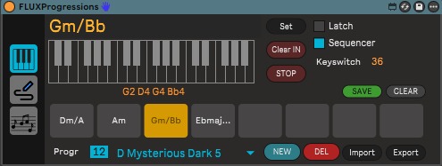
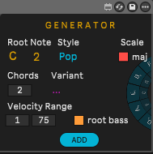
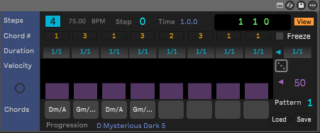
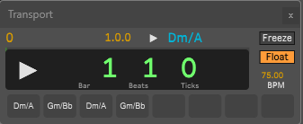
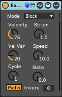
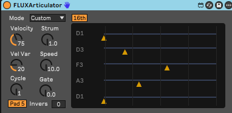
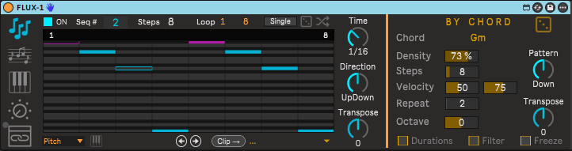

# FLUX

Tools for Ableton Live/M4L MIDI Device  
*Requires Ableton Live Standard/Suite with Max4Live*

**FLUX** is a collection of tools designed to break down the barriers between music theory and production, transforming simple ideas into complete arrangements.

# Devices

| Device | Modules | Description |
| :---- | :---- | :---- |
| **FLUXProgression** | **FLUXSequencer FLUXGenerator FLUXTransport** | Chords Progressions Manager and Sequencer |
| **FLUXArticulator** |  | Chord Articulator |
| **FLUXSteps** |  | Step Sequencer |

**FLUXProgressions** is 

- a relational database of chord progressions;  
- a chord builder to input directly your custom progression  
- an intuitive interface in order to customize your progression  
- 

Also available is the chords progression generator **FLUXGenerator** based on different parameters;

But not just a chord progression manager/generator, but a rhythmic builder with **FLUXSequencer**. Thanks to the 8-step sequencer, you can inject groove into your progressions by controlling the accent (velocity) and duration of every single chord.

With **FLUXTransport** you can control the current progression played with current chord / next chord to be played info and the current song time all in a floating window in order to improve your live/recording performance.

Forget manual note drawing. **FLUXArticulator** transforms your chords into dynamic articulations, creating instant melodic movement that responds perfectly to harmonic changes.

**FLUXSteps** is an advanced step sequencer that generates sequences based on current chords played by **FLUXSequencer** in order to create unique sequences with probability, velocity and extra data to create advanced and mutating (option) sequences.

## FLUXProgressions

Main module to create a progression of up to 8 Chords. Progression can be created by:

* Select one of the almost 2000 ready progressions by style (DB)   
* Custom progression Builder by MIDI Input (Keyboard)  
* Generate progressions with **FLUXGenerator**

Extra features:

* Create/Save a new progression  
* Create new progressions collection  
* Import/Export collection of progressions  

** You can import progressions from the folder progressions **  

## FLUXGenerator

This module generates a new progression based on:

* Root Note  
* Style  
* Scale (major/minor)  
* Total chords to generate  
* Variant (1st inversion / 2nd inversion / wide / widest)  
* Root Bass / Velocity limits

## FLUXSequencer

* Up to 8 Steps Chord Sequence based on the current progression  
* Step Duration (1/128 \- 8/1)  
* Step Velocity (0 \- 127\)  
* Chords List   
* Current song time / tempo

Options
* Freeze : Freeze playing current chord
* Random velocities  
* Global step duration (1/128 \- 8/1)  
* Save Sequence (Pattern) to easy recall/switch  
* Floating song time/tempo and current ► next chord played (**FLUXTransport**)

## FLUXTransport

Floating window with the following info:

* Current Chord played  
* Next Chord to be played  
* Freeze : Freeze playing current chord
* Current song transport time (bars/beats/ticks)  
* Current song tempo  
* List of the sequencer chords to be played

## 	FLUXArticulator (device)

This module is a separate device that can be used in any track when FLUXProgressions is loaded. This gives you the possibility to articulate the current played chord with the following articulation:

- Arp Up  
- Arp Down  
- Arp Up/Down  
- Arp Random  
- Strum Up  
- Strum Down  
- Roll  
- Ping-Pong  
- Custom

The Custom mode plays the chord following the grid input.   
The grid input is active only in Custom mode.

## FLUXSteps

**FLUXSteps is a separated device can be run indipendently by FLUXProgressions**

FLUXSteps has 2 different operation modes:

- **GENERATION** 
- **PERFORMANCE** 

**FLUXSteps generates midi notes to the midi port selected in the Live's device track only when the global transport is running**

## CONTROLS

FLUXSteps is organized in 3 sections:

- a vertical icons tab to select the operation mode (BY CHORD, BY SCALE, STEP RECORDER, MODULATORS, PERFORMANCE)

- a central panel with the Step Sequencer display and general controls:
    (above the sequencer display)
    - Active 
    - Sequence no.
    - Steps
    - Loop from to
    - Randomize
    - Scramble
    (below the sequencer display)
    - Sequencer display mode (All, Pitch, Velocity, Duration, Mod1, Mod2)
    - Ruler activation
    - Shift Left/Right 1 position
    - Clip-> generate the clip of the current sequence in the track selected in the track selector
    - Track selector (set the track has target to generate the clip)

- a right panel with the controls for each of the 5 operation modes

## Operation modes

### GENERATION modes

**All the generation modes are active also when the global transport is active (playing). This means that you can change the current sequence based on any selected mode and the new sequence will be generated and played immediately.**

- **BY CHORD**: chord identification and sequence generation based on the chord notes. (Chords can be sent directly by the Ableton M4L device ChordFlux with no extra code, in this case only chord notes are used)
- **BY SCALE**: generates sequences based on a user selected scale
- **STEP RECORDER**: add to a sequence a singole note at a time (step recording)

### PERFORMANCE modes

- **SHIFTER**: Shifter shift the current sequence (left/right) based on a LFO frequency 
- **MODULATORS**: Shifter LFO, Velocities, Mod1 and Mod2 can be used as modulation sources to map to a different devices parameter 
- **PERFORMANCE**: create a chain of sequences triggered by the LIVE transport

## GENERATION BY CHORD

Takes a set of MIDI pitches (a chord) and generates a sequence of a defined length. It separates the **structure** of the sequence from its **values**, allowing you to tweak musical parameters (like transpose or velocity probability) without losing the random "shape" of your sequence.

### Parameters

- **Length**: The length of the sequence
- **Repeat**: The number of times the sequence for a chord is repeated before to generate a new sequence
- **Density**: The probability of the sequence notes generation (50% means that on length of 8 steps 4 notes will have velocity > 0 and 4 notes will have velocity = 0)
- **Pattern**: The pattern to be used for the sequence generation (random, up, down, updown, cycle)
- **Transpose**: The transpose of the sequence notes
- **Octave Range**: The octave range of the sequence notes
- **Min Velocity**: The minimum velocity of the sequence notes
- **Max Velocity**: The maximum velocity of the sequence notes

Velocities are generated based on density parameter and min/max velocity parameters. The value when not 0 is set randomly in the specified range.

Chords are sent directly by the Ableton M4L device **ChordFlux** with a global message, in this case only chord notes are used and it set the sequence number according to the chord played in ChordFlux (1-8). For more info refer to ChordFlux documentation.

## ChordToSequence.js

A powerful JavaScript sequence generator for Max for Live (V8 Engine). It transforms input chords into musical patterns with advanced velocity control, transposition, and structural consistency.

## Overview

`chordToSequence.js` takes a set of MIDI pitches (a chord) and generates a sequence of a defined length. It separates the **structure** of the sequence from its **values**, allowing you to tweak musical parameters (like transpose or velocity probability) without losing the random "shape" of your sequence.

## Key Features

- **Frozen Sequence Logic**: Random patterns are cached. Changing transpose, octave range, or probability won't "re-roll" the dice, ensuring musical stability.
- **Velocity Generation**: Outputs a dedicated velocity list with a user-defined random range (default 75-100).
- **Probability Silencing**: Controlled chance (0-100%) for notes to have velocity 0 (silence).
- **Octave Variations**: Expands the note pool across multiple octaves (-3 to +3) while keeping original chord notes.
- **Flexible Input**: Supports individual note accumulation, full chord replacement, or the `clear` prefix for atomic updates.

## Message Reference

Send these messages to the JS object's inlet:

| Message | Format | Description |
| :--- | :--- | :--- |
| **`chord`** | `chord 60 64 67 ...` | Replaces the current chord pool. |
| **`clear`** | `clear [notes...]` | Clears pool. If notes follow, it sets them as the new chord. |
| **`length`** | `length [int]` | Sets sequence length (e.g., `length 16`). |
| **`pattern`** | `pattern [name]` | `random`, `up`, `down`, `updown`, or `cycle`. |
| **`transpose`** | `transpose [int]` | Global shift in semitones (-36 to +36). |
| **`octaveRange`**| `octaveRange [int]`| Expands pool by +/- N octaves (-3 to +3). |
| **`probability`**| `probability [0-100]`| Play Probability / Density (100 = always play). |
| **`minVel`** | `minVel [0-127]` | Minimum random velocity. |
| **`maxVel`** | `maxVel [0-127]` | Maximum random velocity. |
| **`generate`** | `generate` | Forces a fresh re-roll of random indices and velocities. |
| **`note`** | `note [pitch] [vel]`| Adds (vel > 0) or Removes (vel = 0) a single pitch. |

## Outlets

- **Outlet 0**: Pitch List (the sequence of note numbers).
- **Outlet 1**: Velocity List (corresponding velocities).
- **Outlet 2**: Combined List (Interleaved `[note, vel, note, vel...]`).

## Usage Tips

1. **Structured Playback**: Set `pattern up` and `octaveRange 1` to create a classic 2-octave arpeggio sweep.
2. **Atomic Updates**: Use `clear 73 77 80` to instantly jump to a new chord without any "orphaned" notes from the previous one.
3. **Midi Mapping**: Map the `probability` and `octaveRange` to dials in your Max patch for expressive live performance control.
